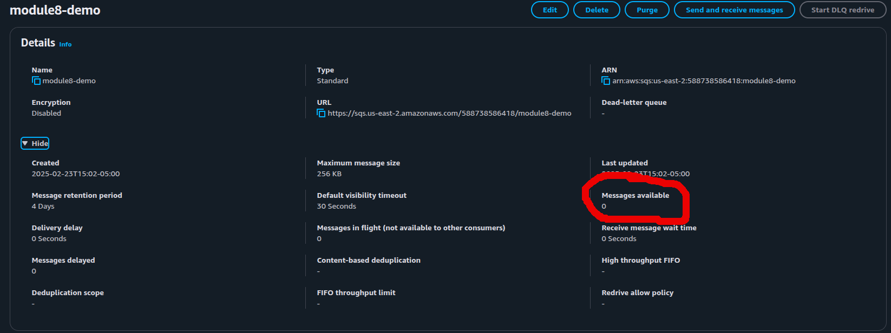
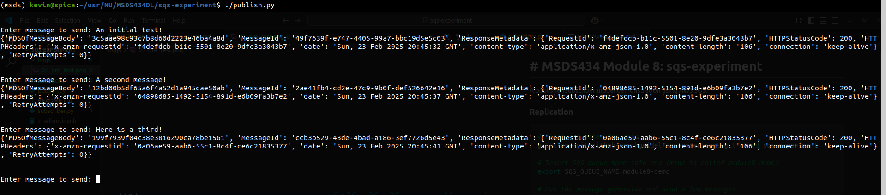
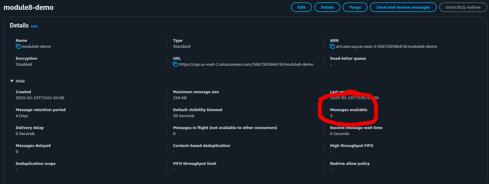
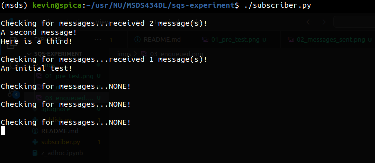

## MSDS434 Module 8: sqs-experiment

A publisher/subscriber model demonstration using AWS SQS.

### Replication

```shell
# Clone and enter the repo
git clone git@github.com:kgeidel/sqs-experiment.git && cd sqs-experiment

# Insert SQS queue name into env (mine is called module8-demo)
export SQS_QUEUE_NAME=module8-demo

# Run the message generator and send a few messages
./publish.py

# Now run the listener and consume them
./subscriber.py
```

### Troubleshooting

* Do the python script files have execute permission? (`chmod u+x publish.py && chmod u+x subscriber.py`)
* Does your boto3 client know how to authenticate? (i.e. is `AWS_ACCESS_KEY_ID` and `AWS_SECRET_ACCESS_KEY` set as needed?)
* Does your SQS queue require additional authentication?
* Does the IAM user or role you are using have access to SQS and your queue in particular?

### Testing the queue

A queue called `module8-demo` is created. The default settings were used with the exception of disabling encryption (my IAM user was granted access to this queue so this is probably not needed.) First step is to confirm the queue is established, empty and ready to accept messages.



The publisher/generator is run and three simple messages are sent.



Confirmation that the messages are in the queue awaiting processing.



Running the subscriber/consumer processed the messages. It is important to note that, depending on the settings of your queue, order is not guaranteed. Our experiment deletes the messages once read using the `ReceiptHandle` value.

